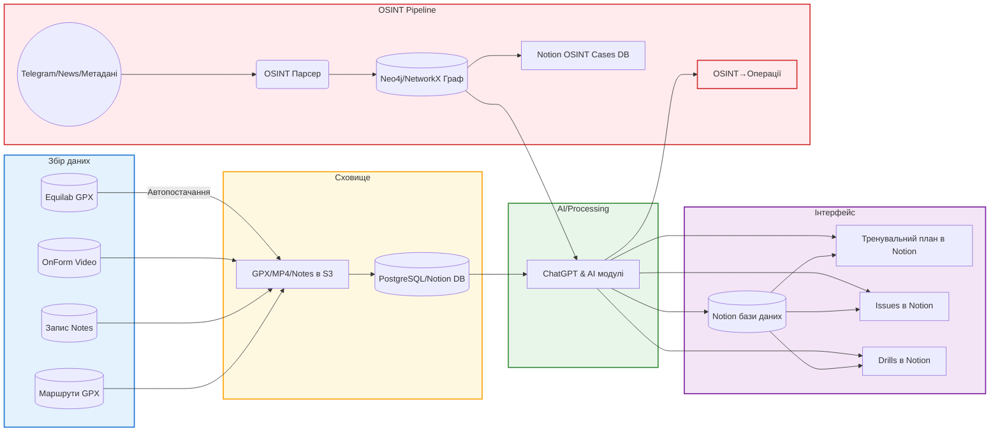

# Короткий огляд

Пропонована система — це **комплексна платформа для навчання верховій їзді**, що поєднує:  
- **Збір даних**: GPS-треки (GPX), відео (MP4), голосові/текстові нотатки з тренувань.  
- **Сховище**: медіафайли (S3/MINIO) + структуровані дані (PostgreSQL через Notion).  
- **AI-аналітику**: ChatGPT-пайплайни для виявлення ключових `ISSUE→DRILL→PLAN`, а також **автопереналаштування PID-контролера**.  
- **Knowledge-модулі**: контекст порід/філософія/етика, історія коней, які додають системі «глибше розуміння» поведінки.  
- **OSINT/OSOPS-модуль**: збір відкритих даних (спонсорські жарти, метео, news, соцмережі) з побудовою графів сутностей (NetworkX/Neo4j) та конвертацією аналітики в оперативні завдання (операції).  
- **Інтерфейс**: Notion бази даних та шаблон сторінки сесії, кнопки дії, AI-промпти з передзаповненими форматами.

Результат – **система з замкнутим циклом навчання**: від даних тренувань через штучний інтелект до плану дій і перевірки. Весь стек написано на Python (3.10+) із PostgreSQL, Redis, Neo4j/NetworkX, S3-сумісним сховищем (MinIO), та OpenAI API.  

**Основні компоненти** наведені на діаграмі архітектури нижче.



---

## Архітектура сервісів і потоків даних

Система складається з наступних шарів:  
- **Інгест-слой**: збирає дані з мобільних додатків (Equilab, OnForm, Komoot, диктофон) і викладає у спільне сховище (S3).  
- **Сховище/База даних**: Notion (або еквівалент) для структурованих даних *sessions, issues, drills, analysis, training_plan, horse_context, osint_cases* (під капотом PostgreSQL), та файлове сховище S3/MinIO для медіа.  
- **AI ядро**: Python-сервіс, що викликає OpenAI ChatGPT API для аналізу сесій і генерації планів (`issue→drill→plan`), а також модулі автоматичного переналаштування (PID-модуль).  
- **OSINT модуль**: збір і парсинг відкритих даних, побудова графу сутностей (Neo4j або NetworkX), виявлення патернів та конвертація в операційні завдання (OSOPS).  
- **Frontend / Notion UI**: інтерфейс для користувача, сторінки сесій, кнопки виконання (Notion buttons) та шаблони сторінок.  

Дані між шарами пересуваються через черги (Redis/RQ або простий цикл). OpenAI API використовується для складної аналітики. Схема взаємодії представлена вище: інгест – сховище – AI – інтерфейс, із паралельною OSINT-пайплайною.

---

## Схема даних у Notion

Структури баз даних (Data Sources) у Notion:

- **Sessions** (записи тренувань)  
  - **Title**: _session name_ (текст)  
  - **Date**: дата  
  - **Horse**: select (назви коней)  
  - **Type**: select (конкур/flat/польові тощо)  
  - **Duration_min**: number (тривалість, хв)  
  - **Distance_km**: number (відстань, км)  
  - **Avg_speed**: number (середня швидкість, км/год)  
  - **Max_speed**: number  
  - **Feeling**: select (шкала «погано/норм/добре/супер»)  
  - **Energy_horse**: select (низька/норм/висока)  
  - **Surface**: select (арена/трава/пісок/змішана)  
  - **Weather**: rich_text (погодні умови)  
  - **Video**: files (посилання на MP4)  
  - **Track_GPX**: files (GPX-файл маршруту)  
  - **Notes_raw**: rich_text (голосові нотатки → текст)  
  - **Status**: status (open/done)  

- **Issues** (проблеми)  
  - **Title**: (назва Issue, текст)  
  - **Category**: select (position/tempo/control/behavior)  
  - **Description**: rich_text (опис проблеми)  
  - **Trigger**: rich_text (умови прояву)  
  - **Detected_in**: relation → *Sessions* (де виявлено)  
  - **Frequency**: number (повторюваність)  
  - **Severity**: select (low/medium/high)  
  - **Status**: select (open/in_progress/fixed)  

- **Drills** (вправи)  
  - **Title**: (назва вправи)  
  - **Goal**: rich_text (мета вправи)  
  - **Category**: select (balance/rhythm/jumping/control)  
  - **Source**: select (Ridley/trainer/AI/custom)  
  - **Difficulty**: select (easy/medium/hard)  
  - **Instructions**: rich_text (алгоритм дій)  
  - **Progression**: rich_text (як ускладнити)  
  - **Linked_Issue**: relation → *Issues* (яка проблема)  

- **Analysis** (результати AI-аналізу)  
  - **Title**: (заголовок, наприклад “Analysis {Date}”)  
  - **Session**: relation → *Sessions*  
  - **Key_Issues**: relation → *Issues* (ключові проблеми)  
  - **Summary**: rich_text (загальний висновок)  
  - **Main_error**: rich_text  
  - **Root_cause**: rich_text  
  - **Pattern**: rich_text  
  - **Confidence**: number (0–100)  

- **Training_Plan** (план наступної сесії)  
  - **Title**: (наприклад “Plan {Date}”)  
  - **Date**: date (дата плану)  
  - **Session_Type**: select (flat/jumping/recovery)  
  - **Focus_Issue**: relation → *Issues*  
  - **Drills**: relation → *Drills* (можливий multi)  
  - **Duration_min**: number  
  - **Notes**: rich_text  
  - **Completed**: checkbox  

- **Horse_Context** (довідка: породи, філософія, патерни)  
  - **Title**: (напр. “Warmblood History”)  
  - **Category**: select (History/Philosophy/Ethics/Pattern)  
  - **Content**: rich_text  

- **OSINT_Cases** (розвіддані)  
  - **Title**: (ID чи короткий опис кейсу)  
  - **Entities**: multi_select (сутності: люди, місця)  
  - **Sources**: rich_text (посилання на джерела)  
  - **Timeline**: rich_text (події по часу)  
  - **Geo**: rich_text (координати/пункт)  
  - **Confidence_Score**: number  
  - **Status**: select (open/verified/discarded)  

Додаткові **Notion кнопки (Buttons)** на сторінці сесії: створення нового Issue/Drill/Plan, генерація пустого шаблону аналізу, закриття сесії.  

---

## JSON імпорт шаблони Notion БД

Наведемо приклад тіла запиту JSON для створення бази даних у Notion API:

```json
{
  "parent": { "type": "page_id", "page_id": "ВАШ_ID_СТОРІНКИ" },
  "title": [{"type":"text","text":{"content":"Sessions"}}],
  "properties": {
    "Session Name": { "title": {} },
    "Date": { "date": {} },
    "Horse": { 
        "select": { "options": [
          {"name":"Horse A","color":"blue"}, {"name":"Horse B","color":"purple"} 
        ] }
    },
    "Type": {
        "select": { "options": [
          {"name":"flat","color":"green"}, {"name":"jumping","color":"yellow"},
          {"name":"польові","color":"orange"}
        ] }
    },
    "Duration_min": { "number": {} },
    "Distance_km": { "number": {} },
    "Avg_speed": { "number": {} },
    "Max_speed": { "number": {} },
    "Feeling": {
        "select": { "options": [
          {"name":"bad","color":"red"}, {"name":"ok","color":"yellow"},
          {"name":"good","color":"green"}, {"name":"strong","color":"blue"}
        ] }
    },
    "Energy_horse": {
        "select": { "options": [
          {"name":"low","color":"red"}, {"name":"normal","color":"blue"}, {"name":"high","color":"green"}
        ] }
    },
    "Surface": {
        "select": { "options": [
          {"name":"arena","color":"gray"}, {"name":"grass","color":"green"},
          {"name":"sand","color":"brown"}, {"name":"mixed","color":"orange"}
        ] }
    },
    "Weather": { "rich_text": {} },
    "Video": { "files": {} },
    "Track_GPX": { "files": {} },
    "Notes_raw": { "rich_text": {} },
    "Status": {
        "select": { "options": [
          {"name":"open","color":"yellow"}, {"name":"done","color":"green"}
        ] }
    }
  }
}
```

```json
{
  "parent": {"type": "page_id", "page_id": "ВАШ_ID"},
  "title":[{"type":"text","text":{"content":"Issues"}}],
  "properties": {
    "Name": { "title": {} },
    "Category": {
      "select": {
        "options":[{"name":"position"},{"name":"tempo"},{"name":"control"},{"name":"behavior"}]
      }
    },
    "Description": { "rich_text": {} },
    "Trigger": { "rich_text": {} },
    "Detected_in": {
      "relation": { "database_id": "ID_DATABASE_Sessions", "type": "dual_property" }
    },
    "Frequency": { "number": {} },
    "Severity": {
      "select": {
        "options":[{"name":"low"},{"name":"medium"},{"name":"high"}]
      }
    },
    "Status": {
      "select": {
        "options":[{"name":"open"},{"name":"in_progress"},{"name":"fixed"}]
      }
    }
  }
}
```

---

## Код: Інґест і обробка даних

### Встановлення пакетів

```bash
pip install gpxpy python-dateutil moviepy openai notion-client neo4j networkx redis rq fastapi uvicorn psycopg[binary] boto3
```

### Інгест GPX

```python
# ingest_gpx.py
import gpxpy, gpxpy.gpx
from datetime import datetime

def parse_gpx(file_path):
    """Зчитує GPX, обчислює відстань і час, зберігає координати."""
    with open(file_path, 'r') as f:
        gpx = gpxpy.parse(f)
    total_distance = 0.0
    start_time = None
    end_time = None
    for track in gpx.tracks:
        for segment in track.segments:
            points = segment.points
            if points:
                start_time = points[0].time
                end_time = points[-1].time
            for i in range(1, len(points)):
                dist = points[i-1].distance_3d(points[i])
                total_distance += dist
    # Обчислюємо тривалість (сек)
    duration_sec = (end_time - start_time).total_seconds() if start_time and end_time else 0
    avg_speed = total_distance / (duration_sec/3600) if duration_sec > 0 else 0
    # У метрах
    max_speed = 0
    if gpx:
        data = gpx.get_moving_data(raw=False)
        max_speed = data.max_speed or 0
    # Повертаємо результат
    return {
        "distance_m": total_distance,
        "duration_s": duration_sec,
        "avg_speed_kmh": avg_speed/1000,   # якщо total_distance в м
        "max_speed_kmh": max_speed * 3.6,  # якщо гpxpy видає м/с
        "start_time": start_time.isoformat() if start_time else None,
        "end_time": end_time.isoformat() if end_time else None
    }
```

### Інгест MP4

```python
# ingest_video.py
from moviepy.editor import VideoFileClip

def get_video_metadata(file_path):
    """Отримує основну інформацію про відео: довжину, FPS, роздільну здатність."""
    clip = VideoFileClip(file_path)
    metadata = {
        "duration_s": clip.duration,
        "fps": clip.fps,
        "resolution": clip.size  # [width, height]
    }
    clip.reader.close()
    clip.audio.reader.close_proc()
    return metadata
```

### Голосові/Текстові нотатки

```python
# ingest_notes.py
def process_notes(text):
    """Попередня обробка (за потреби): очищення, нормалізація."""
    if not text: 
        return ""
    clean = ' '.join(text.strip().split())
    return clean
```

### Зберігання в Сховище (Notion Sync)

```python
# notion_sync.py
from notion_client import Client
import requests

NOTION_TOKEN = "ваш_токен"
notion = Client(auth=NOTION_TOKEN)

def create_session_record(data):
    """Створює сторінку в базі Sessions з даними сесії."""
    session_page = {
        "parent": {"database_id": data["database_id"]},
        "properties": {
            "Session Name": {"title": [{"text": {"content": data["title"]}}]},
            "Date": {"date": {"start": data["date"]}},
            "Horse": {"select": {"name": data["horse"]}},
            "Type": {"select": {"name": data["type"]}},
            "Duration_min": {"number": data["duration_min"]},
            "Distance_km": {"number": data["distance_km"]},
            "Avg_speed": {"number": data["avg_speed"]},
            "Max_speed": {"number": data["max_speed"]},
            "Feeling": {"select": {"name": data["feeling"]}},
            "Energy_horse": {"select": {"name": data["energy"]}},
            "Surface": {"select": {"name": data["surface"]}},
            "Weather": {"rich_text": [{"text":{"content": data["weather"]}}]},
            "Notes_raw": {"rich_text": [{"text":{"content": data["notes"]}}]}
        }
    }
    if "video_url" in data:
        session_page["properties"]["Video"] = {"files": [{"name": "video", "type": "external", "external": {"url": data["video_url"]}}]}
    if "gpx_url" in data:
        session_page["properties"]["Track_GPX"] = {"files": [{"name": "track", "type": "external", "external": {"url": data["gpx_url"]}}]}
    
    response = notion.pages.create(**session_page)
    return response

def sync_analysis(analysis_data):
    """Заносить запис Analysis і пов'язує зессію та issues."""
    res = notion.pages.create(
        parent={"database_id": analysis_data["db_analysis_id"]},
        properties={
            "Session": {
                "relation": [{"id": analysis_data["session_page_id"]}]
            },
            "Main_error": {"rich_text":[{"text":{"content":analysis_data["issue"]["name"]}}]},
            "Root_cause": {"rich_text":[{"text":{"content":analysis_data["issue"]["description"]}}]},
            "Pattern": {"rich_text":[{"text":{"content":analysis_data["issue"]["pattern"]}}]},
            "Confidence": {"number": analysis_data["issue"]["severity_value"]},
            "Key_Issues": {
                "relation": [{"id": analysis_data["issue"]["id"]}]
            }
        }
    )
    return res
```

---

## AI Core: Генерація ланцюжка Issue → Drill → Plan

```python
# chain_generator.py
import openai

openai.api_key = "ВАШ_OPENAI_KEY"

def analyze_session_with_gpt(session_data):
    prompt = generate_prompt(session_data)
    response = openai.ChatCompletion.create(
        model="gpt-4",
        messages=[
            {"role": "system", "content": "Ви помічник з навчання верховій їзді."},
            {"role": "user", "content": prompt}
        ],
        temperature=0.7
    )
    text = response.choices[0].message.content
    return text

def parse_chain_output(text):
    """Розбирає текстовий відгук в словник з ключами Issue/Drill/Plan."""
    sections = text.split("====================")
    result = {}
    for part in sections:
        part = part.strip()
        if part.startswith("ISSUE"):
            result['issue'] = part.split("ISSUE")[1].strip()
        elif part.startswith("DRILL"):
            result['drill'] = part.split("DRILL")[1].strip()
        elif part.startswith("PLAN"):
            result['plan'] = part.split("PLAN")[1].strip()
    return result
```

---

## Автотюнінг PID-контролер (Adaptive PID)

```python
# pid_tuner.py
class PIDController:
    def __init__(self, Kp=1.0, Ki=0.0, Kd=0.0):
        self.Kp = Kp
        self.Ki = Ki
        self.Kd = Kd
        self.error_sum = 0.0
        self.last_error = 0.0

    def update(self, error, dt):
        """Вираховує вихід контролера і оновлює інтегральну суму."""
        self.error_sum += error * dt
        derivative = (error - self.last_error) / dt if dt > 0 else 0.0
        output = self.Kp * error + self.Ki * self.error_sum + self.Kd * derivative
        self.last_error = error
        return output

    def tune(self, error_stats):
        """Автотюнінг на основі статистики помилок."""
        noise = error_stats["noise_variance"]
        bias = error_stats["bias_trend"]
        anticipation = error_stats["anticipation"]
        if noise > 1.0:
            self.Kp *= 0.9
            self.Kd *= 0.8
        if abs(bias) > 0.1: # threshold
            self.Ki += 0.01 * bias
        if abs(anticipation) > 0.1: # threshold
            self.Kd += 0.05 * anticipation
        self.Kp = max(0, min(self.Kp, 10))
        self.Ki = max(0, min(self.Ki, 5))
        self.Kd = max(0, min(self.Kd, 5))
```

---

## OSINT модуль та OSINT→OSOPS міст

```python
# osint_to_osops.py
def score_case(case):
    """Оцінює важливість кейсу: Score = impact * confidence * connectivity."""
    score = case.impact * case.confidence * case.connectivity
    return score

def generate_osops_task(case):
    """Перетворює кейс у завдання."""
    score = score_case(case)
    if score < 60:
        return None
    task = {}
    if score >= 80:
        task["action"] = "immediate_investigation"
    elif score >= 60:
        task["action"] = "monitor"
    task["objective"] = f"Verify event {case.entities[0]} at {case.geo}"
    task["deadline"] = "48h"
    task["resources"] = ["analyst_team"]
    task["criteria"] = "Confirm or refute the pattern"
    return task
```

---

## Розгортання: Docker та конфігурація

**Dockerfile** для бекенду (Python 3.10):
```Dockerfile
FROM python:3.10-slim
WORKDIR /app
COPY requirements.txt .
RUN pip install --no-cache-dir -r requirements.txt
COPY . .
CMD ["uvicorn", "main:app", "--host", "0.0.0.0", "--port", "8000"]
```

**docker-compose.yml**:
```yaml
version: '3.8'
services:
  app:
    build: .
    env_file: .env
    ports: ["8000:8000"]
    depends_on:
      - db
      - minio
      - neo4j
      - redis
  db:
    image: postgres:14
    environment:
      POSTGRES_USER: user
      POSTGRES_PASSWORD: pass
      POSTGRES_DB: horse_db
    volumes:
      - pgdata:/var/lib/postgresql/data
  minio:
    image: minio/minio
    command: server /data
    environment:
      MINIO_ACCESS_KEY: minio
      MINIO_SECRET_KEY: minio123
    ports: ["9000:9000"]
    volumes:
      - miniodata:/data
  neo4j:
    image: neo4j:5
    environment:
      NEO4J_AUTH: neo4j/pass
    ports: ["7474:7474","7687:7687"]
  redis:
    image: redis:7
volumes:
  pgdata:
  miniodata:
```
